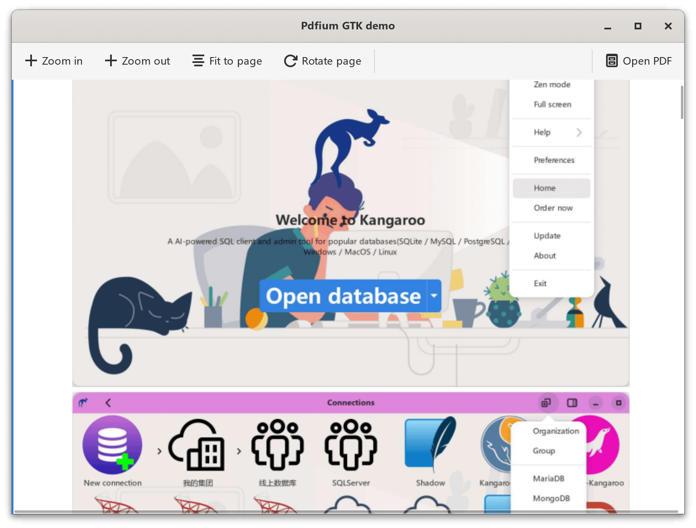
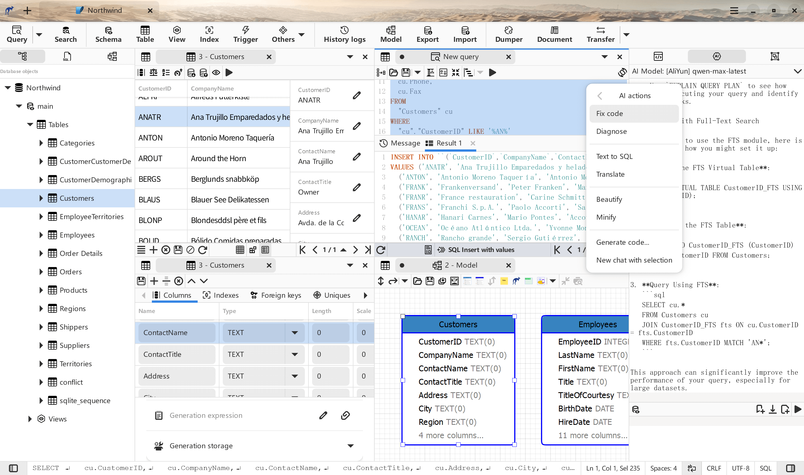

# Pdfium.vapi GTK demo app
Pdfium vapi and example GTK demo app to display PDF content with zoom in / zoom out / fit to page / fit to width / rotate features, the key code is extracted from the project [Kangaroo Database Tool](https://github.com/dbkangaroo/kangaroo)


## Install MSYS2 dependencies
pacman -Syu
pacman -S base-devel autotools git mingw-w64-ucrt-x86_64-gettext-tools mingw-w64-ucrt-x86_64-toolchain mingw-w64-ucrt-x86_64-vala mingw-w64-ucrt-x86_64-libpanel mingw-w64-ucrt-x86_64-gtksourceview5 mingw-w64-ucrt-x86_64-meson mingw-w64-ucrt-x86_64-cmake mingw-w64-ucrt-x86_64-libgee mingw-w64-ucrt-x86_64-json-glib mingw-w64-ucrt-x86_64-libarchive mingw-w64-ucrt-x86_64-libpeas2 mingw-w64-ucrt-x86_64-template-glib mingw-w64-ucrt-x86_64-libtree-sitter mingw-w64-ucrt-x86_64-tree-sitter mingw-w64-ucrt-x86_64-uchardet mingw-w64-ucrt-x86_64-libsoup3 mingw-w64-ucrt-x86_64-editorconfig-core-c mingw-w64-ucrt-x86_64-qrencode mingw-w64-ucrt-x86_64-libshumate mingw-w64-ucrt-x86_64-libfido2 mingw-w64-ucrt-x86_64-desktop-file-utils mingw-w64-ucrt-x86_64-appstream-glib mingw-w64-ucrt-x86_64-dlfcn mingw-w64-ucrt-x86_64-imagemagick mingw-w64-ucrt-x86_64-gobject-introspection

## Download Pdfium library
- Download the pdfium library from [pdfium-binaries](https://github.com/bblanchon/pdfium-binaries)
- Copy the pdfium.pc to the pkgconfig folder, maybe you need update the prefix with install folder

## Generate link object file(dll.a) for GCC
```bash
gendef pdfium.dll
dlltool.exe -d pdfium.def -D pdfium.dll -l pdfium.dll.a
```

## Build and run
meson setup build
meson compile -C build/
./build/pdfium.exe &

## ScreenShot of Kangaroo database tool app
[](https://www.datatable.online/)

[](https://www.datatable.online/)